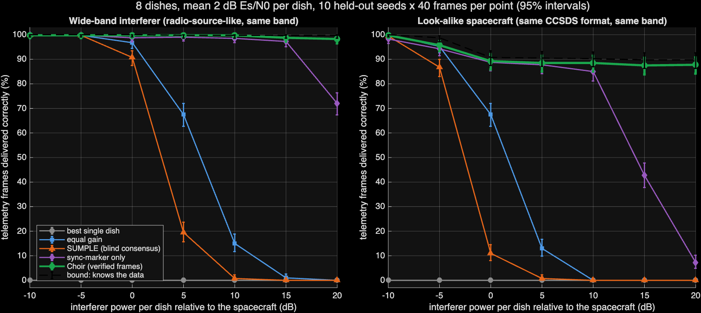
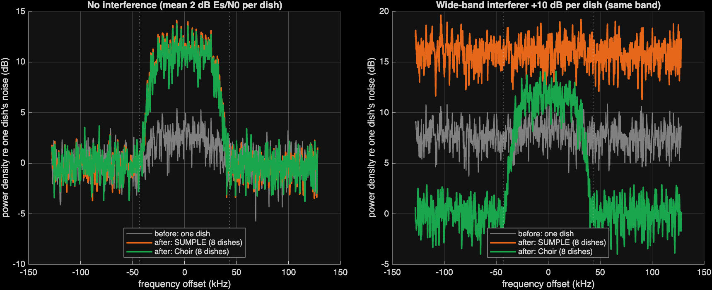
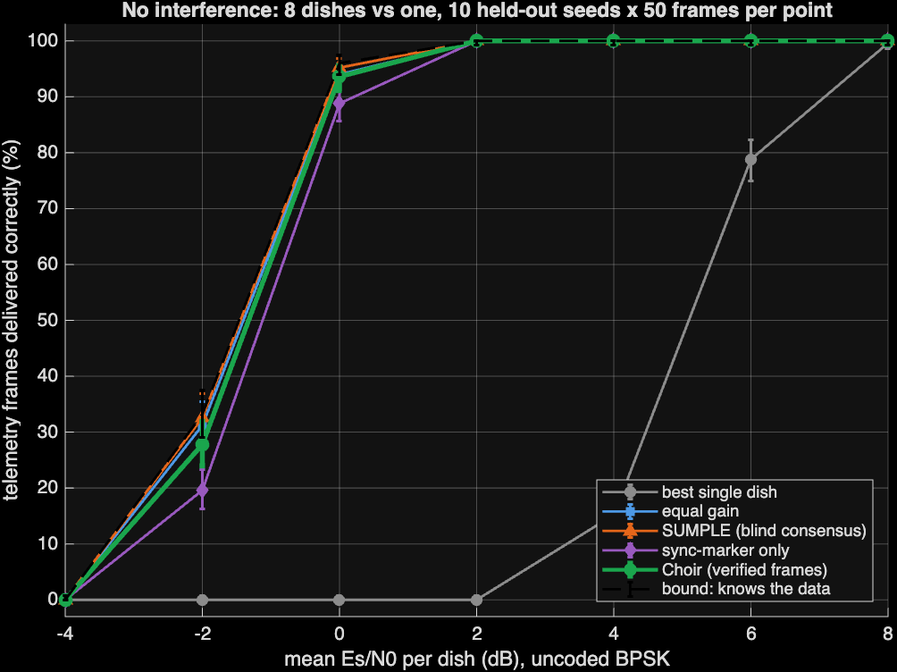
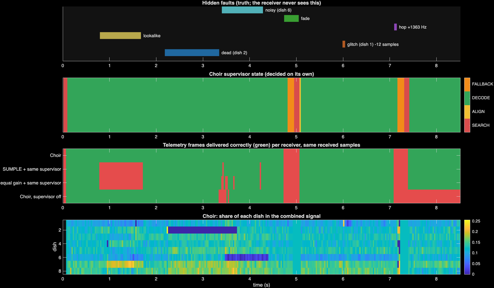
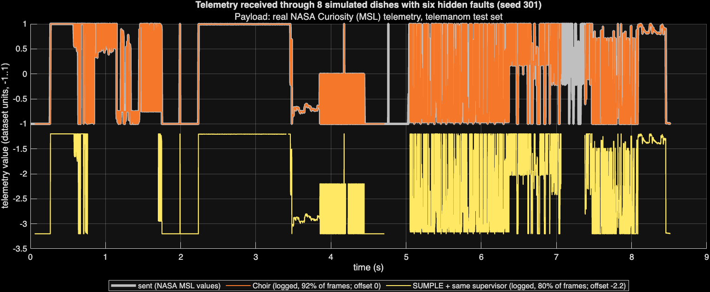

# Choir: an autonomous multi-dish receiver for weak spacecraft telemetry

MATLAB in Space Hackathon, Northeastern University, 3 October 2026. Track 1 (Advanced): Deep-Space Communication & Signal Intelligence.

**Track 1 task:** find, clean, and decode weak radio signals with no human tuning.

## Summary

- **Problem.** One dish cannot decode a very weak spacecraft signal, so the Deep Space Network adds the signals from several dishes (arraying). JPL's SUMPLE method aligns the dishes from the agreement between them only. If a stronger signal reaches all dishes, for example from another spacecraft, SUMPLE aligns the dishes to that signal.
- **Solution.** Choir is a MATLAB receiver for 8 simulated dishes.
  - It finds the carrier, aligns the dishes, decodes CCSDS telemetry frames, and writes a telemetry log.
  - It continues to operate after dish failures, clock errors, carrier frequency hops, fades, and interference.
  - It records the cause of each decision in a log.
- **Method.** Choir calculates the weight of each dish only from verified frames. A verified frame has a correct CRC, the correct spacecraft ID, and the next frame count. Choir uses all received samples to cancel interference.
- **Results.**
  - Interference test: a look-alike spacecraft was 10 dB stronger than the spacecraft at each dish. Choir delivered 88.5% of the frames without bit errors; SUMPLE delivered 0%.
  - Fault test: each run had six hidden faults. Choir delivered 90.6% of the frames; SUMPLE with the same supervisor delivered 77.7%.
  - No receiver logged a frame with incorrect data.
- **Data.** The telemetry values are real NASA Curiosity (MSL) data from the telemanom dataset. The 8-dish radio link is a MATLAB simulation.



## Submission requirements and locations

| Requirement | Location |
|---|---|
| Problem and approach | [Problem](#1-problem), [Method](#2-method) |
| Datasets used | [Data](#7-data) |
| How to run | [How to run](#6-how-to-run): one command, `run_all` |
| Results with plots or images | [Results](#3-results), `choir/results/figures/` |
| Limitations and next steps | [Limitations](#8-limitations-and-next-steps) |
| Track 1: telemetry log | `choir/results/telemetry_log_seed301.csv`; plot `choir/results/figures/telemetry.png` |
| Track 1: before/after spectral plots | `choir/results/figures/spectra.png` |
| Autonomy: drift, dropouts, component failures, no human input | [Autonomy](#4-autonomy), `choir/results/decision_log_seed301.csv` |
| Real mission data | NASA MSL telemetry (telemanom), [Data](#7-data) |
| Slide deck | [`choir/docs/slides.pdf`](choir/docs/slides.pdf); speaker notes in [`choir/docs/speaker_notes.md`](choir/docs/speaker_notes.md) |

## 1. Problem

- **Weak signals.** At a mean Es/N0 of 2 dB per dish, one dish cannot decode an uncoded frame. Eight dishes together can.
- **Alignment.** The receiver must align the dishes in time and phase, and it does not know the data.
- **Interference.** An alignment method that uses only the agreement between dishes can align to a stronger signal that reaches all dishes.
- **Antenna time.** At times, the demand for Deep Space Network time is up to 40% more than the capacity (NASA OIG, 2023).
- **Autonomy.** Track 1 requires operation without manual tuning.

## 2. Method

```
telemetry (NASA MSL) -> CCSDS-style frames + CRC-16 -> ccsdsTMWaveformGenerator (BPSK)
  -> [hidden] 8 dishes: own SNR, delay, drift + seeded faults + interferers
  -> Choir: SEARCH -> ALIGN -> DECODE -> FALLBACK -> SEARCH ... -> telemetry log
  -> independent scorer compares the log with the transmitted data
```

| State | Function | Next state |
|---|---|---|
| SEARCH | Squares the BPSK signal to show the carrier as a tone, adds the spectra of all dishes, and interpolates the peak | ALIGN, when a spectral peak is 12 times the median |
| ALIGN | Finds the sync marker in one frame period on each dish, which gives the frame timing and the delay of each dish. Rejects frames that have a different spacecraft ID | DECODE, when a frame passes the three checks |
| DECODE | Uses the weights `w = Q⁻¹h`. `h` comes only from verified frames (1,816 known symbols each). `Q` is the frame covariance without the spacecraft part, with the noise level as the lower limit. A dish that does not match the verified frames is re-timed (±16 samples) or removed, then tested again every 25 frames | FALLBACK, after 3 bad frames in sequence |
| FALLBACK | Re-times each dish on the sync marker and uses equal weights | DECODE, when a frame passes the checks; SEARCH, after 8 bad frames in sequence |

### Design decisions

- **CCSDS frame structure.** Real spacecraft use the same sync marker and send correct CRCs. Thus a check of the spacecraft ID is necessary.
- **Verified frames.** A verified frame gives 1,816 known symbols, and the sync marker gives 32. This is approximately 17.5 dB more averaging. The "sync-marker only" receiver uses the same calculation as Choir but only the 32 known bits. With a +20 dB look-alike, it delivered 7.3% of the frames and Choir delivered 87.8%.
- **Covariance correction.** The first version used the full frame covariance. At high SNR, it partly cancelled the spacecraft signal, which is a known effect when `h` has small errors. The current version subtracts the spacecraft part (`h hᴴ`) and uses the noise level as the lower limit.
- **Fair comparison.** All receivers use the same samples, the same front end, and the same supervisor, so only the dish weights are different. Without interference, SUMPLE and equal gain are within a few frames of the bound, and a test checks this.
- **No deep learning.** The combining and decoding calculations are known and almost optimal. No training data was available.

## 3. Results

- All numbers come from `choir/run_all.m`.
- Development used seeds 1–30 and 101–120. After that, the receiver was frozen, and the reported results use new seeds 301–320.
- Later changes affected only log text and figure labels, so the numbers did not change.
- The figures show 95% Clopper–Pearson intervals.

| 8 dishes, mean 2 dB per dish | Choir | SUMPLE | Equal gain | Sync-marker only | Bound* |
|---|---|---|---|---|---|
| Look-alike spacecraft +10 dB | **88.5%** | 0.0% | 0.0% | 85.0% | 90.3% |
| Look-alike spacecraft +20 dB | **87.8%** | 0.0% | 0.0% | 7.3% | 89.8% |
| Wide-band source +10 dB | **99.8%** | 0.8% | 15.0% | 98.5% | 99.8% |
| Wide-band source +20 dB | **98.3%** | 0.0% | 0.0% | 72.0% | 99.8% |
| Frames logged with incorrect data | **0** | 0 | 0 | 0 | 0 |

The values are the percentage of frames delivered without bit errors.

\* The bound uses the transmitted bits of each frame. It is a reference, not a receiver. The best single dish delivered 0% in each row because one dish cannot decode at 2 dB.

**Before/after spectra** (Track 1 requirement):
- **No interference:** with 8 dishes, the signal is approximately 10 dB above the noise. With one dish, it is approximately 3 dB above the noise.
- **Wide-band source at +10 dB:** the source increases the noise floor of one dish to 7.7 dB. The SUMPLE output noise floor is 16 dB, and the Choir output noise floor is 0.1 dB.



**No interference.** One dish needs approximately 8 dB. Eight dishes decoded 100% of the frames at 2 dB each.



### Known failure cases

- **Look-alike with a similar arrival pattern.**
  - In seed 304, the similarity between the two signal patterns across the dishes was 0.81. In the other nine geometries, it was 0.16 to 0.58.
  - All receivers failed in seed 304, including the bound.
  - This geometry is the main cause of the values near 89%, not 100%, in the look-alike rows. Seed 305 (similarity 0.58) also lost some frames.
- **Weak signal without interference.** Choir is not better than SUMPLE: at −2 dB, Choir delivered 27.8% and SUMPLE 32.6%. The advantage of Choir is resistance to interference and faults, not sensitivity.

## 4. Autonomy

The fault test has 20 runs. Each run has 300 frames (8.5 s) and six hidden faults at random times and on random dishes. The receiver gets no fault information.
- one dish fails
- one dish has a clock error
- a look-alike spacecraft at +10 dB
- a carrier hop of ±0.5–3 kHz
- a −30 dB fade on all dishes
- one dish with 10 times the noise

| Receiver | Frames correct | Worst run | Recovery after carrier hop | During the look-alike |
|---|---|---|---|---|
| **Choir** | **90.6%** | 80.7% | 284 ms | no interruption |
| SUMPLE + same supervisor | 77.7% | 70.0% | 284 ms | lost the full 0.85 s period |
| Equal gain + same supervisor | 77.3% | 70.7% | 284 ms | lost the full 0.85 s period |
| Choir, supervisor off | 40.0% | 7.7% | no recovery | recovered in 55% of runs |

Dish failures, clock errors, and the noisy dish did not interrupt Choir. The full table is in `choir/results/faults_recovery.csv`.



**Decision log.**
- Choir recorded each hidden fault within 2 frames (57 ms).
- The excerpt below is the program output from `choir/results/decision_log_seed301.csv`. The hidden faults are in `hidden_faults_seed301.csv`.
```
 0.795 s  interference     a strong extra source reaches 8 dishes (21 dB over noise); weights now cancel it
 2.213 s  dish down        dish 2 stopped matching verified frames (fit 0.80 -> 0.01) and was not found nearby: excluded
 3.632 s  dish back        probe found dish 2 again (fit 0.83, timing +0 samples): re-included
 4.937 s  lost             8 bad frames in a row: full carrier re-search
 5.987 s  dish re-aligned  dish 1 stopped matching verified frames (fit 0.75 -> 0.21); timing moved -12 samples, fit now 0.55
 7.406 s  carrier found    +1440.5 Hz (spectral peak/median 1206)
```
The hidden carrier hop was +1363 Hz. With the initial offset (40 Hz) and the drift (5 Hz/s), the true carrier was approximately 1438.5 Hz at that time.

**Telemetry log.** The plot shows real MSL values, logged only from verified frames. A gap is a frame that the receiver did not log.



## 5. Other parts of the repository

- **Simulink** (`choir/simulink/`).
  - A Level-2 MATLAB S-Function runs the same receiver code (`rx_step`) one frame per simulation step.
  - For seed 301, it delivered 275 of 300 frames, the same as the MATLAB run.
  - To run it, use `build_choir_sim`, then `run_choir_sim`.
- **Hardware demo** (shown live, Raspberry Pi Pico).
  - Three LEDs send the same Morse frame, in sequence, to one photoresistor. The frame has a sync pulse, ID C, a counter, the payload MATLAB, and a checksum.
  - In each round, a hidden fault changes the light from one LED (flicker), changes the payload of one LED, or sends a look-alike frame (ID Q) on 2 of 3 LEDs.
  - The majority vote uses the frame that most LEDs agree on. The Choir rule accepts only frames that pass the checksum, have ID C, and have a higher counter.
  - The design makes a look-alike on 2 of 3 LEDs win the vote and fail the Choir ID check.
  - Light intensities add, so this demo shows the acceptance rule, not radio combining.
- **Slides and explainer.**
  - The slides are `choir/docs/slides.pdf`, and the speaker notes are `choir/docs/speaker_notes.md`.
  - The images on the slides are MATLAB outputs: MATLAB figures from `choir/results/figures/`, a MATLAB table of the decision log, and the Simulink model and scope signals.
  - Each number on the slides comes from `choir/deck/numbers.json`, which `choir/deck/make_figs.m` calculates from the results files.
  - `choir/docs/choir-explainer.html` is an animated explainer. Its visuals are illustrations.

## 6. How to run

**Requirements**
- MATLAB R2026b with Communications Toolbox, Satellite Communications Toolbox, Signal Processing Toolbox, DSP System Toolbox, and Statistics and Machine Learning Toolbox.
- Optional: Parallel Computing Toolbox. With it, the full run takes approximately 2 minutes on a 12-core laptop. Without it, the run is serial.

**Procedure**
1. Download the telemanom dataset from Kaggle (`patrickfleith/nasa-anomaly-detection-dataset-smap-msl`, approximately 86 MB).
2. Extract `labeled_anomalies.csv` and `data/data/test/*.npy` into a folder below `choir/res/`. Git does not track this folder.
3. In MATLAB, go to `choir/` and type:
   ```matlab
   run_all          % or, from a terminal: matlab -batch run_all
   ```
4. `run_all` runs `tests/run_tests.m` (7 checks) first. Then it writes all CSV files and figures to `choir/results/`.

If the dataset is not available, the code uses a synthetic signal, and the figure titles show this.

**Tests** (`choir/tests/run_tests.m`)
- The CRC gives the CRC-16/CCITT-FALSE check value 0x29B1.
- A frame is the same after packing and parsing, and the parser rejects a frame with one changed bit.
- The measured BER is 0.0118. The BPSK theory value at 4 dB is 0.0125.
- A clean loopback through the receiver gives correct frames.
- Pure noise gives 0 logged frames.
- Without interference, the baseline receivers are within a few frames of the bound.
- Only the analysis bound can get the transmitted bits.

## 7. Data

| Property | Value |
|---|---|
| Dataset | telemanom: NASA SMAP and Curiosity (MSL) telemetry with labeled anomalies |
| Data used | MSL test-set channels, first column (the telemetry value), in label-file order (M-6, M-1, M-2, S-2, P-10, ...) |
| Values | Scaled to (−1, 1) by the dataset authors. The channel names are anonymous, so no physical units are given. The values are quantized to int16 for the frames |
| Format | One `.npy` file per channel. A short MATLAB `.npy` reader reads the files (`choir/src/telemetry_source.m`) |
| Source | Hundman et al., KDD 2018; https://github.com/khundman/telemanom; Kaggle copy `patrickfleith/nasa-anomaly-detection-dataset-smap-msl` |
| License | The telemanom repository is © 2018 Caltech/JPL, with a BSD-style license. This repository does not contain the data |
| Simulated parts | The radio link (dishes, noise, faults, interferers) is simulated. No multi-dish recording was available |

## 8. Limitations and next steps

- **Simulated radio link.** Next step: recordings from several real stations, for example several SatNOGS stations on one satellite pass.
- **Uncoded BPSK.** With turbo or LDPC codes, all curves move several dB to the left. The receiver logic stays the same.
- **Interferer direction.**
  - The simulation puts interferers near the direction of the spacecraft, so they have the same residual delay at each dish.
  - An interferer far from that direction needs several filter taps per dish.
  - No dish weighting can separate an interferer that arrives in the same way as the spacecraft.
- **Start-up with interference.** Choir needs verified frames to calculate the weights. Interference that is present before the first verified frame is a weak case.
- **Spoofing.** The checksum detects noise errors. It does not stop an intentional false transmitter, which needs authenticated frames, for example CCSDS SDLS.
- **Not implemented:**
  - Elastic arraying, which releases dishes when the margin is sufficient. The explainer shows it as a next step.
  - A Stateflow version of the supervisor.

## 9. Prior work and project contribution

- **Prior work.**
  - The Deep Space Network has used arraying for decades.
  - SUMPLE: Rogstad, IPN Progress Report 42-162 (2005).
  - JPL changed SUMPLE for wide-band interferers in the beam (NASA Tech Brief NPO-45640) and studied arrays with interfering sources (IPN PR 42-150).
  - Antenna weights from known or decoded data are standard in wireless engineering.
- **This project.**
  - A receiver that operates without operator input and calculates the dish weights only from verified frames (CRC, spacecraft ID, and frame count).
  - It cancels interference with the statistics of the current frame, recovers from faults, and records the cause of each decision.
  - A comparison on identical samples against SUMPLE, equal gain, a sync-marker-only receiver, and a bound. The tests include a look-alike spacecraft with the same bandwidth, which the published bandwidth-based method does not address.

## 10. Credits and license

- **Data:** NASA/JPL SMAP and MSL telemetry from telemanom (Hundman, Constantinou, Laporte, Colwell, and Soderstrom, KDD 2018).
- **References:**
  - Rogstad, *The SUMPLE Algorithm for Aligning Arrays of Receiving Radio Antennas*, IPN PR 42-162 (2005).
  - NASA Tech Brief NPO-45640, *Aligning a Receiving Antenna Array to Reduce Interference*.
  - *Large-Array Signal Processing for Deep-Space Applications*, IPN PR 42-150.
  - NASA OIG, *Audit of NASA's Deep Space Network*, IG-23-016 (2023).
- **Tools:**
  - MATLAB R2026b and `ccsdsTMWaveformGenerator` (Satellite Communications Toolbox).
  - Communications, Signal Processing, DSP System, Statistics and Machine Learning, and Parallel Computing Toolboxes; Simulink.
- **AI assistance:** the code was written with AI assistance (Devin) during the hackathon. The team reviewed and ran the code.

## Repository structure

```
choir/
├── run_all.m              calculates all numbers and figures (runs the tests first)
├── src/                   receiver and simulation
│   ├── choir_params.m     all settings, frozen before evaluation
│   ├── frame_pack.m / frame_parse.m     CCSDS-style frames + CRC-16
│   ├── tx_build.m         ccsdsTMWaveformGenerator transmitter
│   ├── channel_make.m / channel_slot.m  hidden simulation: dishes, faults, interferers
│   ├── rx_init.m / rx_step.m            receiver and supervisor
│   ├── score_run.m        independent scorer
│   ├── exp_*.m            experiments and figures
│   └── telemetry_source.m MSL reader (.npy), with a labeled synthetic signal if the data is not available
├── tests/run_tests.m      checks for the results
├── results/               CSV files, decision and telemetry logs, figures
├── simulink/              the same receiver in Simulink
├── deck/                  slide sources: make_figs.m, numbers.json, deck.html, figures
├── docs/                  slides.pdf, speaker_notes.md, choir-explainer.html
└── res/                   telemanom data (not in Git)
```
